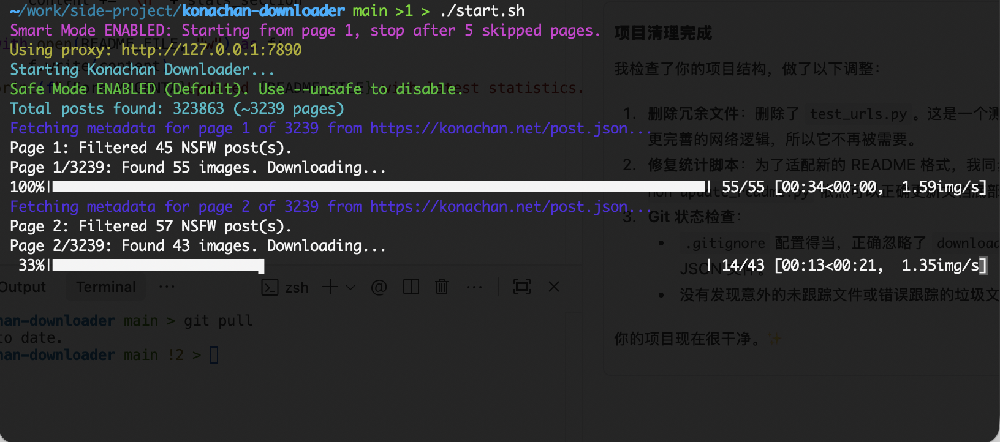

# Konachan Downloader


[](https://pypi.org/project/konachan-downloader/)




A high-performance CLI tool designed for efficiently downloading images from **konachan.net**. It features a smart update system, resumable downloads, and multi-threading support.

## ✨ Key Features

- **🔄 Smart Update**: Automatically checks for new uploads on page 1 and stops once it catches up to your local library. No more scanning thousands of old pages!
- **⚡ High Performance**: Multi-threaded downloader utilizes full bandwidth.
- **⏯️ Resumable**: Skips existing files and remembers your last position.
- **🛡️ Secure**: Defaults to Safe Mode. Unsafe Mode supports Cloudflare bypass logic.
- **🔍 Robust**: Built-in retries for network stability.

## 🚀 Quick Usage

### The "Best Practice" Way
Use **Smart Mode** to keep your collection up to date. It starts from Page 1 and automatically stops when it hits 5 consecutive pages of already-downloaded images.

```bash
konachan-dl --tags "hatsune_miku" --smart
```

### Other Commands

**Download Everything (First Run)**
```bash
# Resume automatically from where you left off
konachan-dl --tags "hatsune_miku"
```

**Unsafe Mode (NSFW)**
```bash
# Switches to konachan.com
konachan-dl --tags "scenery" --unsafe
```

**Custom Range**
```bash
konachan-dl --tags "vocaloid" --start 1 --end 10
```

## ⚙️ Installation

### Homebrew (Recommended for macOS)
```bash
brew tap smallyunet/tap
brew install konachan-downloader
```

### PyPI
```bash
pip install konachan-downloader
```

### From Source (Developers)
```bash
git clone https://github.com/smallyunet/konachan-downloader.git
cd konachan-downloader
python3 -m venv .venv && source .venv/bin/activate
pip install -r requirements.txt
```

## 📊 Statistics

| Metric | Value |
| :--- | :--- |
| **Total Images** | `22089` |
| **Total Data** | `142.09 GB` |
| **Total Time** | `06:13:19` |
| **Current Disk** | `143.29 GB` |

